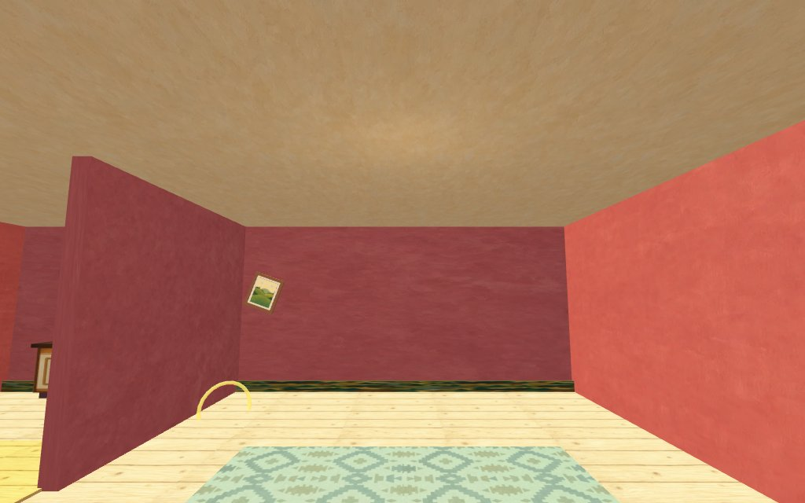
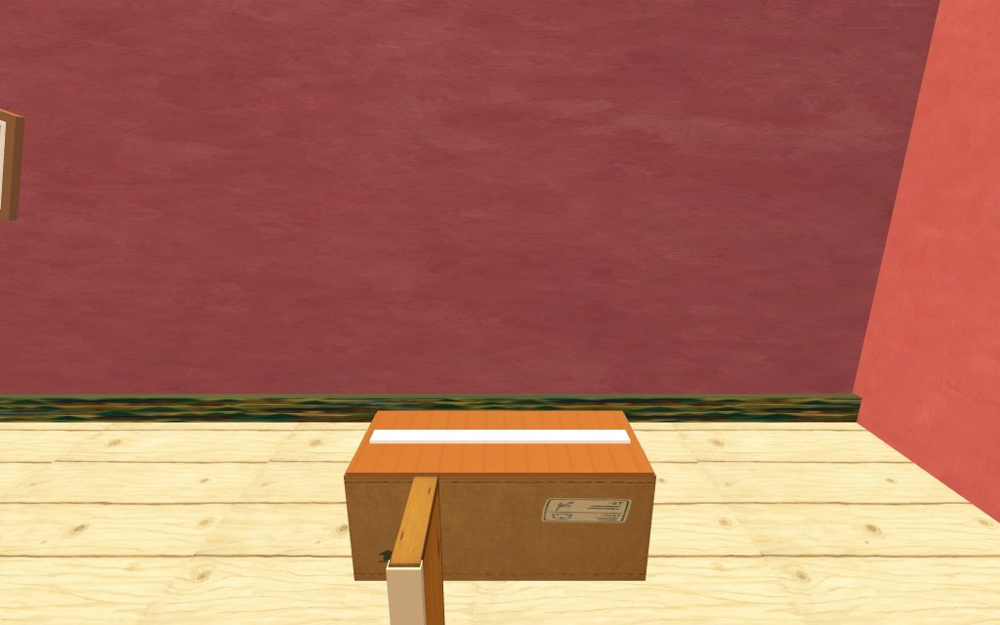
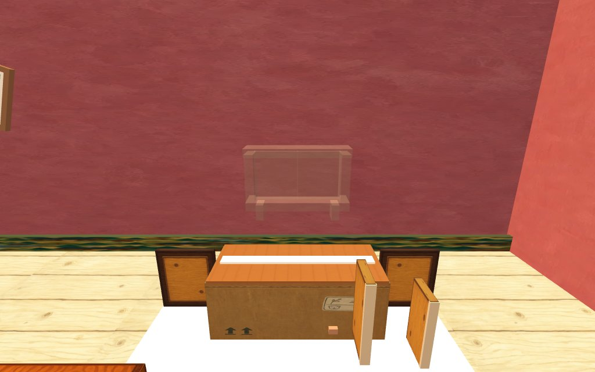
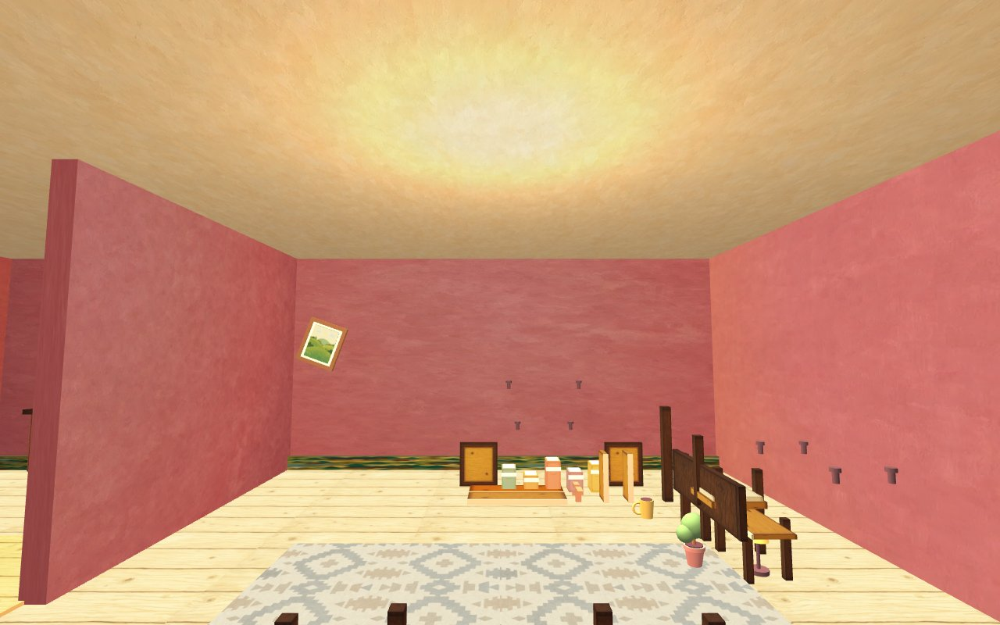

# Settle In — Case Study

> **A first-person cozy game about moving back into a home that's been empty for years — you order the furniture, carry it in, and build a life into place until the house is warm enough to say *welcome home*.**

**Type / Genre / Platform** — H5 (mobile web), first-person cozy organizing sim, runs in any browser
**Role** — Creator & pipeline director (design direction, tool orchestration, taste calls — not prompt-and-pray)
**Stack** — Claude Code (Opus) · Babylon.js + TypeScript + Vite · WebAudio (all SFX synthesized, zero audio files) · gpt-5.4-image-2 for painted surface skins · rezona-pgc skill pipeline (game-plan → plan-assets → gen-image / gen-model-3d)
**Links** — ▶ *play it* `[dev: bunx vite → :5188]` · 🎬 *clip* `[TODO]` · 💾 *source* `settle-in/` (self-contained, no framework lock-in)

---

## The Pitch

Settle In is what you get when you fuse the two most-loved halves of two different games. From **House Flipper** it takes the body: you walk the rooms in first person and assemble flat-pack furniture *in the place it will live* — no detached workshop, no timer. From **A Little to the Left** it takes the hands: close-up, drag-and-snap organizing where the rules are wordless and every correct placement lands with a chime, a sparkle, and a little jump.

The glue is the theme. You're not decorating a showroom — you're re-inhabiting a home. You order a bookshelf from an in-world catalog on a laptop by the door, wait for the doorbell, carry the taped parcel in hugged against your chest, set it down, slice the tape, and build it where it belongs. There is no score. The reward is the room getting warmer — literally, the lights swell from dim to golden as each task finishes. If a stranger read only this paragraph, the question they'd ask is *"can I just… live in it for an hour?"* — which is exactly the feeling.

## The Creative Problem

I wanted a specific emotional register — the quiet, slightly tender feeling of putting your life back together in a familiar space — and that register is fragile. It's killed instantly by the things games reflexively add: a timer, a star rating, a fail state. So the whole project was really an exercise in **restraint under a vision**, encoded as five pillars that the AI was never allowed to violate:

1. **No fail state, no timer, no score.** (House Flipper 2's *timed* assembly is its community's most-hated feature; A Little to the Left is beloved precisely for being failure-free.)
2. **Diegetic everything.** Assembly happens where the furniture lives. The hint is a scribbled notebook page you erase. No menu-button minigames.
3. **Always respond to an attempt.** A silent near-miss is the single worst documented flaw in the reference game. Every wrong move must *answer* — tilt, slide home, a one-line hint — and every right move must *celebrate*.
4. **Transformation is the reward** — delivered continuously (the room warming) instead of hoarded for an end screen.
5. **Touch-first, one pointer does everything.** Never require precision a thumb can't deliver.

The hard part wasn't building interactions. It was building a system that could grow to **15 furniture stations** without any of them ever betraying those five rules. The pillars became the spec the AI coded against, and my job was to be the taste that caught every drift.

## Process — the loop I ran

**Direction.** I started by having two full research studies (House Flipper and A Little to the Left) distilled into a single authoritative `GAME_BIBLE.md` — pillars, a complete one-pointer verb grammar, a "feedback law," a palette, and framing rules. This is the document that drove the AI, not the other way around. What I *rejected* mattered as much as what I kept: HF2's detached timed workshop (out), chime-only feedback (out — every sound got a mandatory visual twin for accessibility), saturated primaries and PBR gloss (out — the look is flat matte gouache).

**Orchestration.** I chained a purpose-built skill pipeline: `game-plan` to lock the design doc, `plan-assets` to enumerate every sprite/model/sound, then the generation skills to produce them. The runtime is deliberately self-contained — vanilla Babylon.js + TypeScript, no React, no framework — so the whole thing stays legible and portable. All sound effects are *synthesized in code* (WebAudio) rather than sourced as files: wood clunks, ceramic rings, tape rasps, ratchet ticks, each short and quiet, each with a soft universal chime layered on top.

**Iteration — a concrete one.** The art direction went through **three passes**. I generated full 3D GLB furniture meshes *twice* — the "correct" AAA-pipeline move — and rejected both. The sculpted geometry read as generic; it wasn't the vibe. The fix was to invert the whole approach: build every object from **hand-placed primitives wrapped Minecraft-style in painted PNG skins** — a plank with a drawn outline and knots, cardboard with a doodled shipping label, a book cover with a border frame. The charm lives in the *painted face*, not the *mesh*. That's a judgment no generator makes for you.

**The human-only parts.** Two bugs are worth naming because they show where AI needs a human eye. First, a **framing bug**: parts staged on the floor projected at ~200% screen height in the focus camera — literally invisible — until I established the "assembly mat" convention and a `project()` check that every station must pass. Second, a **Babylon emissive gotcha**: the engine *adds* the emissive texture on top of the base, so assigning a skin as emissive at full strength silently washed every surface toward white and erased the book tints. Both were caught by looking at the screen, not by reading green test output — which is why the debug harness drives *real* pointer events and steps frames manually, rather than trusting flag-only tests.

## A Signature Detail

The moment I'm proudest of is the **order-and-carry loop** — because it started as a shortcut and became the soul of the game.

Originally, boxes just waited pre-staged in each room. Functional, dead. So I rebuilt the outer loop: there's now a laptop on a crate by the front door running a `settle.home` catalog. You order a flat-pack item, a short delivery wait passes, the *doorbell rings*, and the taped parcel lands on the porch outside. To use it you have to walk out, pick it up — and while your arms are full, **carrying is the only verb you have.** The parcel rides hugged at chest height; you can't do anything else until you set it down at its spot. That single constraint is the whole theme in miniature: settling in is a sequence of small deliberate acts, one armful at a time. The dependency graph rides on top of it — you can't *order* the books until you've built the shelf — so the house furnishes itself in a story order without a single tutorial line.

## Outcome / Results

- **Scope:** 15 authored furniture stations, each with 1–6 sequential assembly phases, spanning a living room, kitchen nook, bedroom, and bathroom — plus the full order → deliver → carry → build outer loop.
- **Velocity:** taken from empty folder to a deep, debugged, verifiably-playable slice in a matter of **days, not weeks** — the entire art, audio, and code pipeline run by one person directing tools.
- **Portability:** zero external runtime dependencies for content — every sound is synthesized and every prop is primitive-built, so the game ships as a tiny self-contained Babylon bundle.
- **Qualitative signal:** the five pillars held across all 15 stations. Nothing in the game has a timer, a score, or a silent failure — the design constraint survived contact with scale, which is the real result.

*(Play/retention numbers to be added once the build is shared.)*

## Visuals

Captured live from the running game (`docs/shots/`) — driven headlessly through the debug hooks:

**1 — "Before": the empty living room.** The whole game opens here: bare rose walls, a cream plank floor, a patterned rug, one crooked picture. This is the blank canvas the warmth gets painted onto.

**2 — The signature moment: slicing the parcel.** A taped moving-box on the assembly mat, its painted shipping-label skin and tape seam ready to cut. This is the first thing your hands do at every station.

**3 — The build loop in one frame.** The opened parcel, the flat-pack boards staged on the mat, and the translucent *ghost* of the finished shelf floating on the wall — target above, parts below, exactly as the framing law prescribes. Everything you need to solve the puzzle reads without a word of text.

**4 — The payoff: the room goes warm.** After the front-room tasks finish, the mood light swells from a dim ~0.12 to a golden ~0.95 — the ceiling glows, the picture now hangs straight. Lighting *is* the progress bar. *(Captured via debug snap-solve, so some multi-part furniture on the right is imperfectly seated — see the note below.)*

**Still worth capturing** (need a real playthrough or a compositing pass, not the debug shortcut):
- **A pristine furnished "after"** — a fully, correctly assembled room. Requires driving real drag input through each station (the debug snap-solve leaves multi-part pieces and bolts mis-seated).
- **The order loop, as DOM+3D composite** — laptop catalog → doorbell toast → parcel on porch → carrying it hugged to the chest. The HUD/shop panel is a DOM overlay, so it isn't in these canvas grabs.
- **Pipeline artifact** — the three art-direction passes side by side (GLB pass 1 → GLB pass 2 → painted-skin primitives): shows the taste call, not just the output.

> **Capture method (reproducible):** the continuous render loop makes the normal screenshot tool time out, and `canvas.toDataURL()` only grabs the 3D layer (not the DOM HUD). Recipe: size the canvas explicitly, dismiss the curtain, pose the camera via `__settleIn.player`, step frames with `__settleIn.tick(n)`, then POST `canvas.toDataURL()` to a tiny local shot-server and read the saved JPEG. Scene state was driven by entering stations through the real `TaskManager` and snapping puzzle pieces to their slots.
